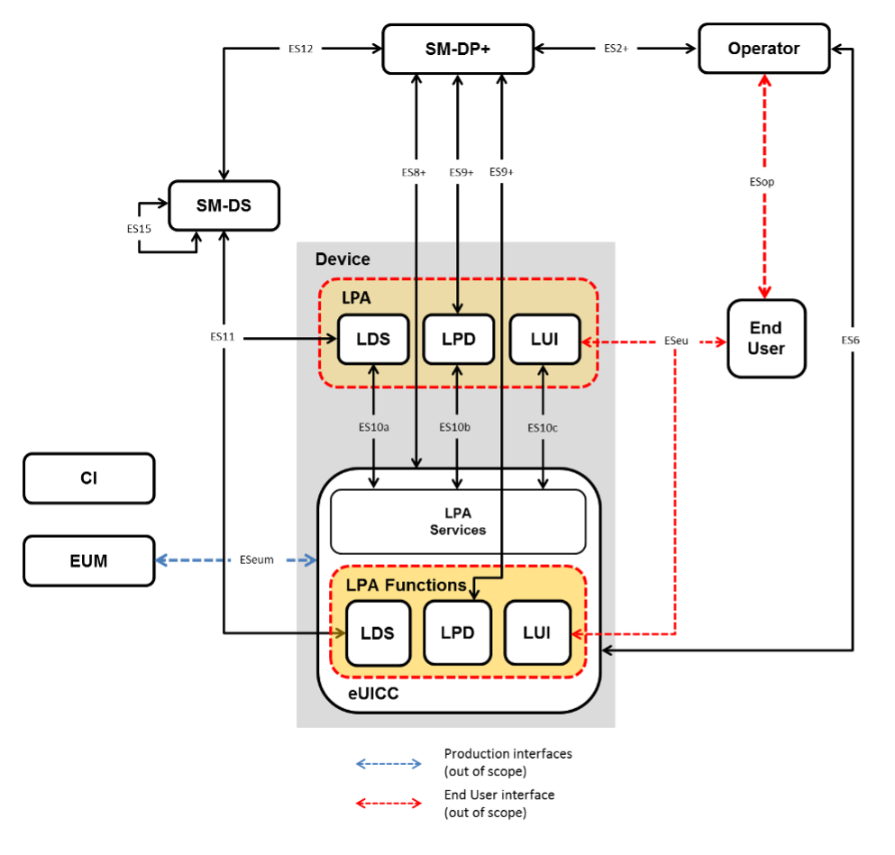

# eSIM Quick Start

## Remote SIM Provisioning System Architecture

## Specifications

- [GSMA SGP.21] - RSP Architecture
- [GSMA SGP.22] - RSP Technical Specification
- [GSMA SGP.23] - RSP Test Specification
- [GSMA SGP.24] - RSP Compliance Process
- [GSMA SGP.26] - RSP Test Certificates Definition
- [GSMA SGP.14] - GSMA eUICC PKI Certificate Policy
- [GSMA FS.04] - SAS-UP Standard
- [GSMA FS.05] - SAS-UP Methodology
- [GSMA FS.08] - SAS-SM Standard
- [GSMA FS.09] - SAS-SM Methodology
- [GSMA FS.17] - SAS Consolidated Security Requirements

[GSMA SGP.21]: https://www.gsma.com/esim/resources/sgp-21-v2-5/ "SGP.21 v2.5"
[GSMA SGP.22]: https://www.gsma.com/esim/resources/sgp-22-v2-5/ "SGP.22 v2.5"
[GSMA SGP.23]: https://www.gsma.com/esim/resources/sgp-23-v1-13/ "SGP.23 v1.13"
[GSMA SGP.24]: https://www.gsma.com/esim/resources/sgp-24-rsp-compliance-process-v2-5/ "SGP.24 v2.5"
[GSMA SGP.26]: https://www.gsma.com/esim/resources/sgp-26-test-certificate-definition-v1-5/ "SGP.26 v1.5"
[GSMA SGP.14]: https://www.gsma.com/esim/resources/gsma-euicc-pki-certificate-policy-v21/ "SGP.26 v2.1"
[GSMA FS.04]: https://www.gsma.com/security/wp-content/uploads/2023/04/FS.04-SAS-UP-Standard-v9.2.pdf "FS.04 v9.2"
[GSMA FS.05]: https://www.gsma.com/security/wp-content/uploads/2023/04/FS.05-SAS-UP-Methodology-v10.1.pdf "FS.05 v10.1"
[GSMA FS.08]: https://www.gsma.com/security/wp-content/uploads/2023/04/FS.08-SAS-SM-Standard-v3.2.pdf "FS.08 v3.2"
[GSMA FS.09]: https://www.gsma.com/security/wp-content/uploads/2023/08/FS.09-SAS-SM-Methodology-v8.1.pdf "FS.09 v8.1"
[GSMA FS.17]: https://www.gsma.com/security/wp-content/uploads/2021/07/FS.17-SAS-Consolidated-Security-Requirements-v7.0.pdf "FS.17 v7.0"

## References

- <https://iecho.cc/2023/10/20/Convert-eSIM-to-physical-SIM/>
- <https://blog.i64d.com/zhe-teng-esim-3hk/>
- <https://support.apple.com/HT209096>
- <https://github.com/Infineon/optiga-connect-iot>
- <https://github.com/ravens/awesome-telco>
- <https://github.com/calee0219/awesome-5g>
